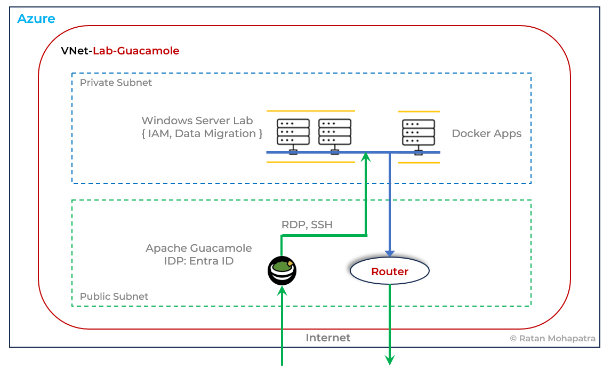

[](LICENSE)


# Terraform Azure Lab – Secure Remote Access Architecture

## Overview

This project deploys a **secure Azure lab environment** using **Terraform**, centered around **Apache Guacamole** as a web‑based remote access gateway.

The lab enables **browser‑based SSH and RDP access** to private workloads without exposing internal machines directly to the internet.

The design follows **Zero Trust principles**:

- No public IPs on internal workloads
- Controlled ingress via Guacamole
- Infrastructure as Code (Terraform)
- Lab‑friendly and production‑aware structure

---

## High‑Level Architecture



*Figure: High‑level architecture of the Azure Guacamole Lab*

---

## Quick Start

### Prerequisites

- Azure subscription
- Azure CLI (`az login`)
- Terraform ≥ 1.6
- Git

### Steps

```bash
git clone https://github.com/ratanGit/terraform-azure-lab.git
cd terraform-azure-lab

terraform init
terraform plan
terraform apply
```
⚠️ **Warning**
This lab deploys Azure resources that may incur cost. Remember to destroy the environment when finished:
```bash
terraform destroy
```

### Key Components
*   **Azure Virtual Network (VNet‑Lab‑Guacamole)**
    *   Public Subnet (Guacamole access)
    *   Private subnet (internal workloads)
*   **Apache Guacamole**
    *   HTTPS remote access gateway
    *   Browser‑based SSH/RDP
*   **Private Workloads**
    *   Windows Server lab VMs
    *   Internal Linux / Docker lab
*   **Security Controls**
    *   Network Security Groups
    *   No public access to internal VMs
    *   Entra ID Authentication based access to Guacamole (ZT)
    *   Let's Encrypt TLS certificate

***

## Network Flow

### Inbound (User Access)

1.  User connects via **Internet (HTTPS)**
2.  Traffic reaches **Apache Guacamole**
3.  Guacamole **proxies**:
    *   SSH to Linux VMs
    *   RDP to Windows Servers
4.  Connections terminate in the private subnet

### Outbound (Internet Access from Private Subnet)

1.  Private VMs send outbound traffic
2.  Azure Route Table sends `0.0.0.0/0` to **Linux Router**
3.  Linux Router performs **NAT (iptables)**
4.  Traffic exits via router’s **public IP**
5.  No Azure NAT Gateway required

***

## Infrastructure as Code
*   **Terraform**:
    *   Environment‑driven variables
    *   Centralized locals and tagging for Azure resources
    *   Clear, readable structure
    *   Centralized Change Documentation
*   **Terraform‑managed SSH**:
    *   SSH key generation
    *   No Hardcoded credentials
*   **Terraform‑automation of VMs**:
    *   Cloud-init based automation for Docker, Guacamole & Router
## Outputs
    *   Guacamole public IP
    *   VM private IPs
    *   Data for Terraform projects built on the base networking
    *   Helpful SSH connection commands
```bash
terraform output access_information
```

### NGINX Proxy Manager – Guacamole Configuration
sample nginx.conf
```bash
# Redirect root to Guacamole
location = / {
    return 301 /guacamole/;
}

# Apache Guacamole reverse proxy
location /guacamole/ {
    proxy_pass http://guacamole-app:8080/guacamole/;
    proxy_buffering off;
    proxy_http_version 1.1;

    proxy_set_header Upgrade $http_upgrade;
    proxy_set_header Connection "upgrade";
    proxy_set_header X-Forwarded-For $proxy_add_x_forwarded_for;
    proxy_set_header X-Forwarded-Proto $scheme;
    proxy_set_header X-Forwarded-Host $host;

    proxy_read_timeout 3600s;
    proxy_send_timeout 3600s;
```
***

## Future Enhancements

*   WireGuard VPN
*   High‑availability ingress
*   Terraform modules
*   OPNsense Firewall to replace the linux router

***

## Cost Optimization

| Component | Azure Native         | This Project    |
| --------- | -------------------- | --------------- |
| NAT       | Azure NAT Gateway    | Linux Router    |
| Cost      | High (monthly fixed) | Low (VM only)   |
| Control   | Limited              | Full (iptables) |

This design significantly reduces monthly Azure spend for lab and non‑production environments.

***

## Author

**Ratan Mohapatra**  
Azure | AWS | Zero Trust | Cloud Architecture | Terraform | Nextgen Firewalls

***


## License

This project is licensed under the MIT License. See the [LICENSE](LICENSE) file for details.
